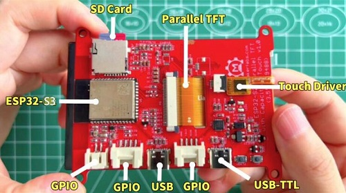
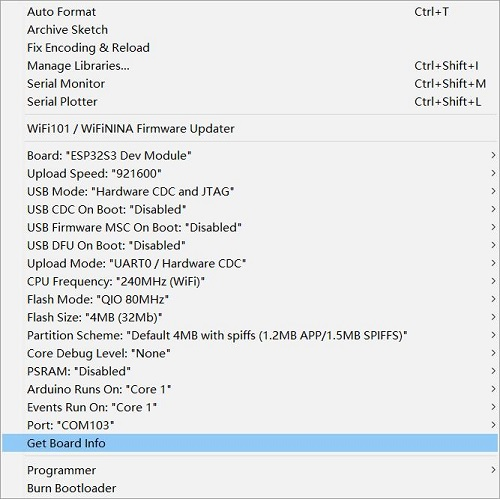

# Makerfabs ESP32-S3 Parallel TFT with Touch

```c++
/*
Version:		V1.0
Author:			Vincent
Create Date:	2022/5/24
Note:
	
*/
```


[toc]

# Makerfabs

[Makerfabs home page](https://www.makerfabs.com/)

[Makerfabs Wiki](https://makerfabs.com/wiki/index.php?title=Main_Page)

# Makerfabs ESP32-S3 Parallel TFT with Touch
## Intruduce

Product Link ：[]()

Wiki Link : []()

The 3.5" 320x480 TFT LCD driver is ILI9488, it uses 16bits parallel line for communication with ESP32-S2, the main clock could be up to 20MHz, make the display smooth enough for videos; You can freely use some of Mabee pins(A I2c and a IOs) with the breakout connectors, to connect the ESP32-S2 display with sensors/ actuators, suitable for IoT applications.



## Feature

- Integrated ESP32-S3 with 2.4G WiFi
- Wi-Fi Protocols: 802.11b/g/n(802.11n up to 150Mbps),A-MPDU and A-MSDU aggregation and 0.4us guard interval support
- Wi-Fi Frequency range: 2.402GHz - 2.483Ghz
- Arduino Compatible: You can play it with Arduino IDE
- LCD 3.5 inch Amorphous-TFT-LCD (Thin Film Transistor Liquid Crystal Display) for mobile-phone or handy electrical equipment
- LCD Driver: ILI9488(16bits parallel line)
- LCD Resolution: 320*480
- FT6236 Series ICs are single-chip capacitive touch panel controller IC with a built-in 16 bit enhanced Micro-controller unit (MCU)
- NS2009: A 4-wire resistive touch screen control circuit with I2C interface, which contains A 12-bit resolution A/D converter
- Power supply: 5V, Type-C USB
- Micro SD card slot on the board
- Dual USB Type-C: one for native USB and one for USB-to-UART
- Two Mabee interfaces
- Board size: 66mm * 85mm


# Code Explain

## Complier Option

- Install board : ESP32 .
- Install library : LovyanGFX library. 
- Edit the code based on the touch screen. If you use resistive screen, choice NS2009_TOUCH. If you use capacitive screen, choice FT6236_TOUCH. 
- Use type-c use cable connect USB-TTL to PC.
- Upload codes, select "ESP32-S3 DEV Module" and "UART0"



## Firmware

### SD16_3.5

Factory firmware. First run the boot self-test to check the hardware. Press down the middle of the touch screen as prompted to display a LOGO picture on the SD card. Finally, print the touch coordinates in the serial port.
